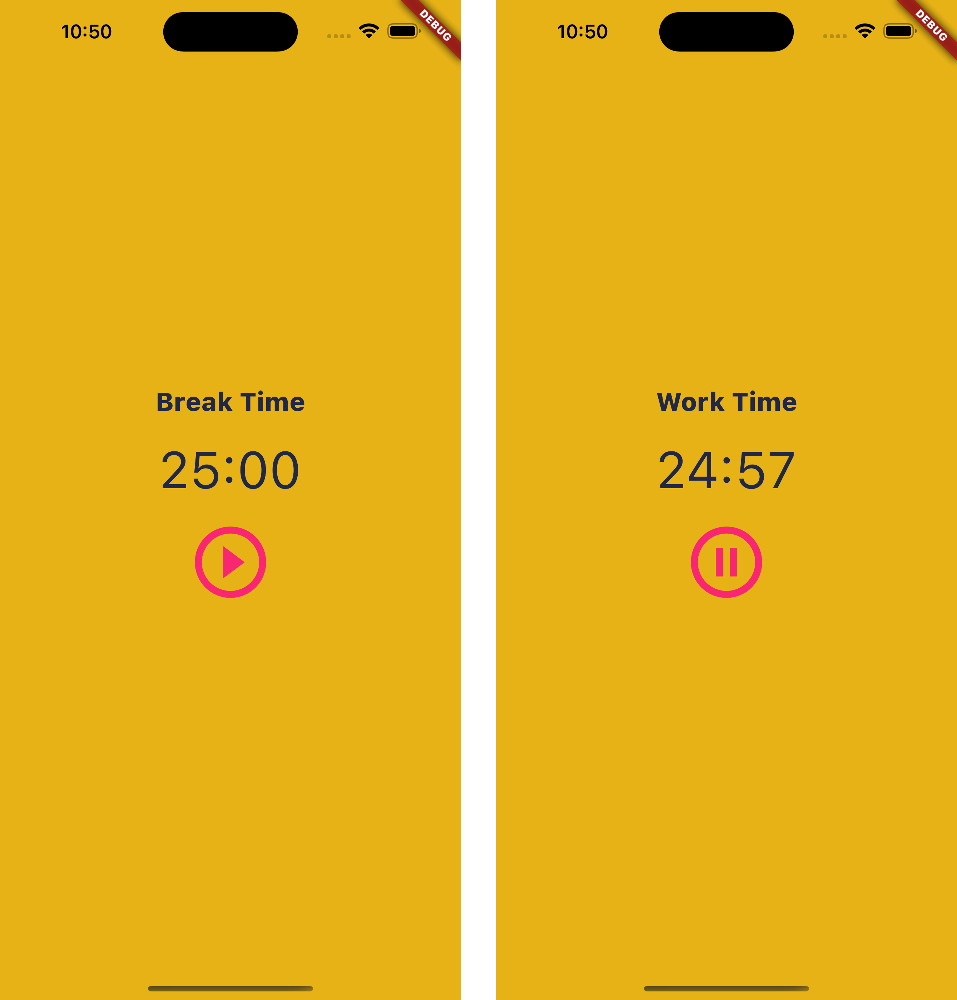

## Flutter 1. Pomodoro Timer

### Result  

`pomodoro.dart` 파일 참고.  

Check this [demo](https://github.com/CAVASOL/flutter_script/blob/main/lib/pomodoro.dart).



### Retrospect

> pomodoro timer를 개인적으로 작업하고 있었어서 디자인이 조금 수월했어요. 아이콘 버튼으로 타이머를 정지하거나 실행할 수 있도록 구성했습니다. 위젯을 연결하는 부분이 아직은 서툴지만 재밌어요.


---


### AIFFEL Campus Online Code Peer Review Templete

- 코더 : 김연
- 리뷰어 : 김대선
1. 코드가 보기 쉽게 잘 정리가 되어있어서 좋았습니다.
2. 구동도 직접 확인하였는데 깔끔한 구동도 좋았습니다.
3. 제 로컬에서는 환경상 맞지 않는지 구동을 못해본 것이 아쉽지만 많이 배우는 시간이 되었습니다.

### PRT

- [V]  **1. 주어진 문제를 해결하는 완성된 코드가 제출되었나요?**
    - 문제에서 요구하는 최종 결과물이 첨부되었는지 확인
    - 문제를 해결하는 완성된 코드란 프로젝트 루브릭 3개 중 2개, 퀘스트 문제 요구조건 등을 지칭
    - 해당 조건을 만족하는 코드를 캡쳐해 근거로 첨부
    - 네 정상적으로 잘 구동이 되었으며 간결하고 좋았습니다.
      


    
- [V]  **2. 전체 코드에서 가장 핵심적이거나 가장 복잡하고 이해하기 어려운 부분에 작성된 주석 또는 doc string을 보고 해당 코드가 잘 이해되었나요?**
    - 해당 코드 블럭에 doc string/annotation이 달려 있는지 확인
    - 해당 코드가 무슨 기능을 하는지, 왜 그렇게 짜여진건지, 작동 메커니즘이 뭔지 기술.
    - 주석을 보고 코드 이해가 잘 되었는지 확인
    - 잘 작성되었다고 생각되는 부분을 캡쳐해 근거로 첨부합니다.

   
- [V]  **3. 에러가 난 부분을 디버깅하여 문제를 “해결한 기록을 남겼거나”, ”새로운 시도 또는 추가 실험을 수행”해봤나요?**
    - 문제 원인 및 해결 과정을 잘 기록하였는지 확인
    - 문제에서 요구하는 조건에 더해 추가적으로 수행한 나만의 시도, 실험이 기록되어 있는지 확인
    - 잘 작성되었다고 생각되는 부분을 캡쳐해 근거로 첨부합니다.

        
- [V]  **4. 회고를 잘 작성했나요?**
    - 주어진 문제를 해결하는 완성된 코드 내지 프로젝트 결과물에 대해 배운점과 아쉬운점, 느낀점 등이 기록되어 있는지 확인
    - 전체 코드 실행 플로우를 그래프로 그려서 이해를 돕고 있는지 확인
    - 잘 작성되었다고 생각되는 부분을 캡쳐해 근거로 첨부합니다.
  


        
- [V]  **5. 코드가 간결하고 효율적인가요?**
    - 파이썬 스타일 가이드 (PEP8) 를 준수하였는지 확인
    - 하드코딩을 하지않고 함수화, 모듈화가 가능한 부분은 함수를 만들거나 클래스로 짰는지
    - 코드 중복을 최소화하고 범용적으로 사용할 수 있도록 함수화했는지
    - 잘 작성되었다고 생각되는 부분을 캡쳐해 근거로 첨부합니다.
    - 네 전체적으로 깔끔하고 간결해보였습니다.


### 참고 링크 및 코드 개선

```
# 코드 리뷰 시 참고한 링크가 있다면 링크와 간략한 설명을 첨부합니다.
# 코드 리뷰를 통해 개선한 코드가 있다면 코드와 간략한 설명을 첨부합니다.
```
