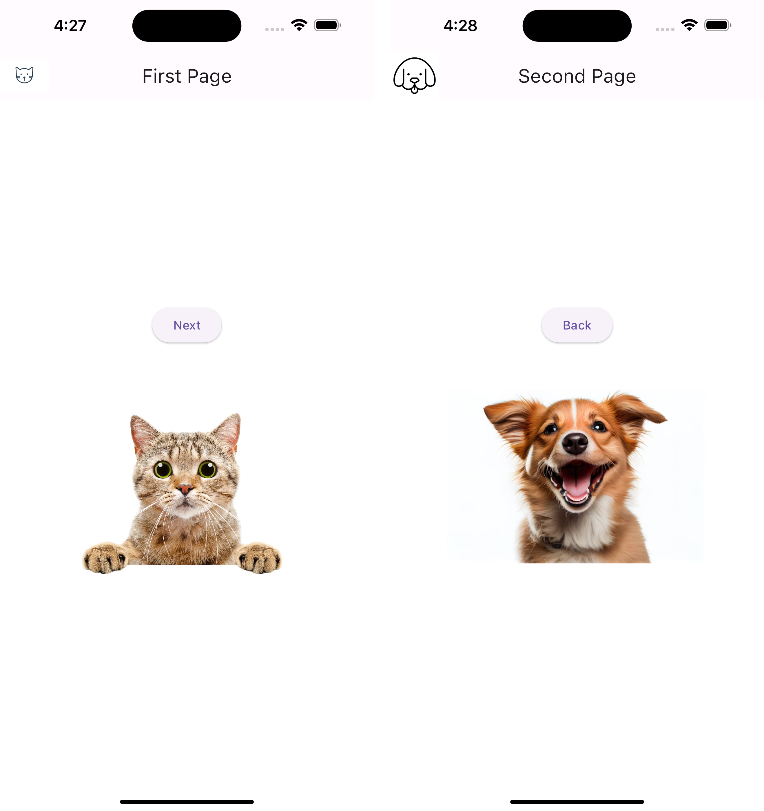
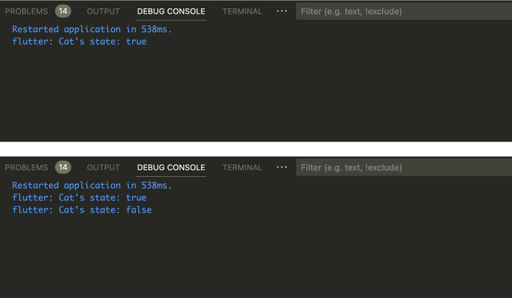

## Flutter 3. Two Pages

### Result 

`pages.dart` 파일 참고.  

Check this [demo](https://github.com/CAVASOL/flutter_script/blob/main/lib/pages/pages.dart).

### Retrospect

> 각각 고양이와 강아지의 사진이 있는 두 개의 페이지가 있고, 버튼을 누르면 콘솔에 cat의 상태가 표시되면서 화면이 이동합니다. Navigator()를 활용한 간단한 화면 구성을 디자인하였는데 재밌었습니다. 

---

### AIFFEL Campus Online Code Peer Review Templete

- 코더 : 김연
- 리뷰어 : 조필선

### PRT

- [V]  **1. 주어진 문제를 해결하는 완성된 코드가 제출되었나요?**
    -> 네, 주어진 요구 조건에 부합하는 완성된 코드가 제출되었습니다.
      
    
- [V]  **2. 전체 코드에서 가장 핵심적이거나 가장 복잡하고 이해하기 어려운 부분에 작성된 주석 또는 doc string을 보고 해당 코드가 잘 이해되었나요?**
  
    -> 주석을 통해서 해당 코드가 의미하는 바를 기술하고 있습니다.

   
- [V]  **3. 에러가 난 부분을 디버깅하여 문제를 “해결한 기록을 남겼거나”, ”새로운 시도 또는 추가 실험을 수행”해봤나요?**
    -> 전체 코드중에 특별히 에러가 난 부분은 없는 것처럼 보입니다.
   
        
- [V]  **4. 회고를 잘 작성했나요?**
    
    
    
  - 각 Class 별로 함수를 모듈화 하여 소프트 코딩 스타일로 전체코드를 완셩하였습니다. 또한 전체적으로 깔끔하고 간결해 보입니다.
   

### 참고 링크 및 코드 개선

