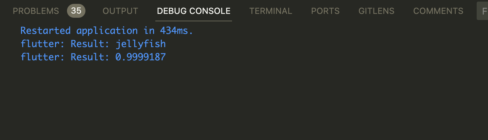

## Flutter 4. Jellyfish

### Result 

`jelly.dart` 파일 참고.  

Check this [demo](https://github.com/CAVASOL/flutter_script/blob/main/lib/jellyfish/jelly.dart).




### Retrospect

> 로컬에서는 레이블과 확률을 확인할 수 있었는데 미니앱에서는 데이터를 불러오는 과정에서 오류가 생겼어요. 오류를 해결하기 위해 코드를 여러차례 수정했지만 503오류를 막을 수 없었습니다. 아쉬워요. ----- 로컬에서 try it out을 실행하지 않은 상태에서 디버깅을 시도하였고, 그 결과 각각의 버튼을 눌렀을 때 콘솔에 레이블 또는 확률이 출력되었어요. 

---

### AIFFEL Campus Online Code Peer Review Templete

- 코더 : 김연
- 리뷰어 : 이혁희

### PRT

- [ ]  **1. 주어진 문제를 해결하는 완성된 코드가 제출되었나요?**
    - 버튼에 따라 다른 서비스를 요청하고 그 결과를 받아서 보여주는 코드를 작성하였습니다.
    ```
    //                 ElevatedButton(
    //                   style: ElevatedButton.styleFrom(
    //                     backgroundColor: Colors.cyan,
    //                   ),
    //                   onPressed: () => fetchUrlData(
    //                       "https://9e18-34-83-37-72.ngrok-free.app/sample1"),
    //                   child: const Text(
    //                     'Label',
    //                     style: TextStyle(
    //                       fontSize: 16,
    //                       color: Colors.white,
    //                     ),
    //                   ),
    //                 ),
    //                 ElevatedButton(
    //                   style: ElevatedButton.styleFrom(
    //                     backgroundColor: Colors.cyan,
    //                   ),
    //                   onPressed: () => fetchUrlData(
    //                       "https://9e18-34-83-37-72.ngrok-free.app/sample2"),
    //                   child: const Text(
    //                     'Score',
    //                     style: TextStyle(
    //                       fontSize: 16,
    //                       color: Colors.white,
    //                     ),
    //                   ),
    //                 ),
    //               ],    
    ```

    ```
    //   Future<void> fetchUrlData(String url) async {
    //     try {
    //       final response = await http.get(
    //         Uri.parse(url),
    //         headers: {
    //           'Content-Type': 'application/json',
    //           'ngrok-skip-browser-warning': '69420',
    //         },
    //       );
    //       if (response.statusCode == 200) {
    //         final data = jsonDecode(response.body);
    //         print("URL: $url");
    //         print("predicted_label: ${data['predicted_label']}");
    //         print("prediction_score: ${data['prediction_score']}");
    //       } else {
    //         print(
    //             "Failed to fetch data from $url. Status Code: ${response.statusCode}");
    //       }
    //     } catch (e) {
    //       print("Error fetching data from $url: $e");
    //     }
    //   }

    ```
    
- [ ]  **2. 전체 코드에서 가장 핵심적이거나 가장 복잡하고 이해하기 어려운 부분에 작성된 
주석 또는 doc string을 보고 해당 코드가 잘 이해되었나요?**
    - 코드가 이해하기 쉽게 작성되었습니다.(리뷰1 참조)
        
- [ ]  **3. 에러가 난 부분을 디버깅하여 문제를 “해결한 기록을 남겼거나” 
”새로운 시도 또는 추가 실험을 수행”해봤나요?**
    - "Label", "Score" 버튼에 각각 다른 URI를 적용하여 서버에서 다른 함수를 실행하여 결과를 리턴하게 작성하였습니다.
    ```
    //                   onPressed: () => fetchUrlData(
    //                       "https://9e18-34-83-37-72.ngrok-free.app/sample1"),

    ```

    ```
    //                   onPressed: () => fetchUrlData(
    //                       "https://9e18-34-83-37-72.ngrok-free.app/sample2"),

    ```
        
- [ ]  **4. 회고를 잘 작성했나요?**
    - 회고를 작성하였습니다.
    ```
    > 로컬에서는 레이블과 확률을 확인할 수 있었는데 미니앱에서는 데이터를 불러오는 과정에서 오류가 생겼어요. 오류를 해결하기 위해 코드를 여러차례 수정했지만 503오류를 막을 수 없었습니다. 아쉬워요.
    ```

- [ ]  **5. 코드가 간결하고 효율적인가요?**
    - 코드가 간결하게 잘 작성되었습니다. 특히 fetchUrlData 함수에서 url을 인자로 사용하여 코드안에서 별도의 처리가 필요없게 코딩하였습니다.
    
